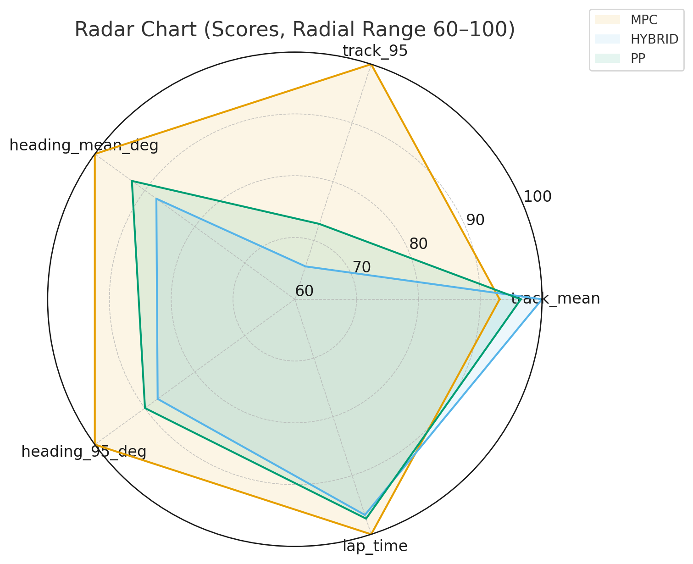

# Autonomous Driving Programming

**Pure Pursuit · Hybrid · MPC with Safety & Escape System**

---

## 1. Project Overview

본 프로젝트는 **ForzaETH 기반 자율주행 레이스카 시뮬레이션 환경**에서
다양한 주행 제어 알고리즘을 직접 구현하고,
이를 **안전 시스템 및 성능 평가 체계와 함께 통합**하는 것을 목표로 한다.

Pure Pursuit(PP)를 기준으로 시작하여,

* **Hybrid Controller (PP + 보정 로직)**
* **Pure Pursuit 기반 MPC 구조**
* **Safety Monitor 및 Escape Planner**

를 단계적으로 설계·구현하였으며,
실제 주행 로그를 기반으로 **정량적인 성능 비교**를 수행하였다.

본 프로젝트는 알고리즘 구현에 그치지 않고,

> *실제 주행 중 발생 가능한 위험 상황을 고려한
> “적용 가능한 자율주행 제어 시스템” 구현*을 목표로 한다.

---

## 2. System Architecture

시스템은 ROS2 기반으로 구성되며,
**Controller Manager 노드**를 중심으로 각 기능 모듈이 유기적으로 동작한다.

```
controller_cpp
 ├─ controller_manager_cpp
 │   ├─ Pure Pursuit Controller
 │   ├─ Hybrid Controller
 │   └─ MPC Controller
 │
 ├─ safety_monitor
 ├─ escape_planner
 └─ common interfaces
```

### 전체 제어 흐름

1. 차량 상태(Odometry, Heading, Track Error) 수신
2. Safety Monitor가 주행 안전 여부 판단
3. 정상 상황
   → 선택된 주행 컨트롤러 실행
4. 위험 상황
   → Emergency Stop
   → Escape Planner 실행
   → 기준 경로 복귀 후 정상 주행 재개

---

## 3. Controllers

### 3.1 Pure Pursuit (Baseline)

Pure Pursuit는 기준 경로 상의 Lookahead Point를 추종하는
기하학 기반 제어 알고리즘이다.

* 구현이 단순하고 계산량이 적음
* 직선 구간에서 안정적인 성능
* 급커브 구간에서 오차 증가

본 프로젝트에서는 **모든 성능 비교의 기준(Baseline)** 으로 사용하였다.

---

### 3.2 Hybrid Controller

Hybrid Controller는 Pure Pursuit를 기본으로 하되,
주행 상황에 따라 **조향 및 속도를 추가 보정**하는 방식이다.

**설계 의도**

* 곡률이 큰 구간에서 PP의 한계 보완
* track error 증가 시 보정 강화
* 급격한 조향 명령 완화

Pure Pursuit의 안정성과
보정 기반 제어의 유연성을 결합한 구조이다.

---

### 3.3 MPC Controller (PP-based MPC)

본 프로젝트의 MPC는
일반적인 **동역학 모델 기반 MPC와는 다른 구조**를 가진다.

#### 핵심 아이디어

* 차량 모델을 직접 최적화하지 않음
* 여러 개의 Lookahead 후보를 생성 (PP 기반)
* 각 후보에 대해 **미래 주행 시뮬레이션** 수행
* track error / heading error 기준으로 최적 후보 선택

즉,

> **Pure Pursuit를 기반으로 한 시뮬레이션 중심 MPC 구조**

이다.

#### 장점

* 복잡한 차량 모델 불필요
* 구현 난이도 대비 높은 안정성
* 실제 주행 로그 기반 평가와 높은 일관성

---

## 4. Safety & Escape System

### 4.1 Safety Monitor

주행 중 차량이 위험 상태에 진입했는지를 지속적으로 감시한다.

**판단 기준 예시**

* 과도한 track error
* 오차의 지속적인 증가
* 특정 조건에서의 비정상 주행 패턴

조건 만족 시 `/safety/trigger`를 활성화하여
Emergency Stop을 수행한다.

---

### 4.2 Escape Planner

Emergency 상황에서
차량이 **스스로 트랙으로 복귀**하도록 설계된 모듈이다.

#### 동작 시퀀스

1. Emergency Trigger 감지
2. 후진(BACKWARD) 단계 수행
3. 차량과 기준 경로의 상대 위치 분석
4. 회전 방향 결정
5. 기준 경로 재획득 후 정상 주행 복귀

단순한 고정 회전 방식이 아닌,
**상황 인지 기반 탈출 로직**을 목표로 설계하였다.

---

## 5. Source Application Guide

본 프로젝트는 아래와 같은 구조로 적용된다.

### 5.1 Source Structure

```
controller_cpp/
 ├─ src/
    ├─ controller_manager_cpp.cpp
    ├─ hybrid.cpp
    ├─ mpc.cpp
    ├─ safety_monitor.cpp
    └─ escape_planner.cpp
 ├─ include/
    ├─ hybrid.hpp
    ├─ mpc.hpp
    ├─ safety_monitor.hpp
    └─ escape_planner.hpp
 └─ CMakeLists.txt
```

* `controller_manager_cpp`
  : 전체 제어 흐름 관리 및 컨트롤러 선택

* `hybrid`, `mpc`
  : 각 주행 알고리즘 구현

* `safety_monitor`
  : 주행 안전 판단

* `escape_planner`
  : Emergency 상황 복구 로직

### 5.2 적용 및 실행 개념

1. 노드 실행 후 차량 상태 및 경로 정보 수신
2. Controller Manager가 설정된 알고리즘 선택
3. Safety Monitor가 실시간으로 주행 상태 감시
4. Emergency 발생 시 Escape Planner 자동 개입

각 소스 파일의 세부 동작 과정과 파라미터 의미는
📎 **첨부된 적용 설명서 PDF**에 단계별로 정리되어 있다.

---

## 6. Performance Evaluation

세 가지 컨트롤러(PP / Hybrid / MPC)를
**동일한 트랙과 로그 조건**에서 비교 평가하였다.

### 6.1 Evaluation Metrics

* `track_mean` : 평균 횡방향 오차
* `track_95` : 상위 5% 제외 횡방향 오차
* `heading_mean_deg` : 평균 헤딩 오차
* `heading_95_deg` : 상위 5% 제외 헤딩 오차
* `lap_time` : 완주 시간

각 항목별 최고 성능을 100점으로 정규화하여 점수화하였다.

### 6.2 Radar Chart Analysis



#### 결과 해석

* **MPC**

  * 모든 항목에서 가장 균형 잡힌 성능
  * 95% 지표에서 특히 우수 → 주행 안정성 높음
  * lap time에서도 가장 좋은 결과

* **Hybrid**

  * 평균 track error에서 우수
  * PP 대비 곡선 구간 성능 개선 확인

* **Pure Pursuit**

  * 단순 구조 대비 안정적인 기준 성능
  * 큰 오차 상황에서 성능 저하

이를 통해
**MPC > Hybrid ≈ PP**의 성능 경향을 정량적으로 확인하였다.

---

## 7. Conclusion

본 프로젝트는

* 다양한 주행 제어 알고리즘의 직접 구현
* Safety / Escape 시스템 통합
* 실제 로그 기반 성능 평가

를 통해
**실제 적용을 고려한 자율주행 제어 시스템**을 설계·검증하였다.

특히,
Pure Pursuit 기반 MPC 구조는
구현 복잡도를 낮추면서도 높은 주행 안정성을 확보할 수 있음을 확인하였다.

---
